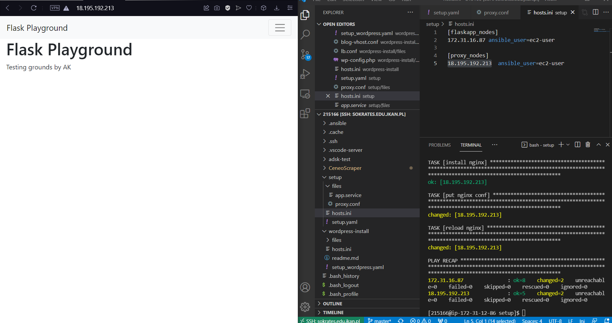
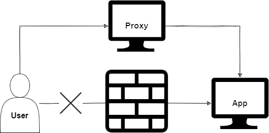

# Flask App Ansible Automation
## Instalacja
1. Utworzenie dwóch maszyn wirtualnych z wykorzystaniem AWS
2. Połączenie z sokrates.edu.jkan.pl
3. Utworzenie `hosts.ini` deklarującego IP utworzonych maszyn wirtualnych
4. Utworzenie folderu ``files`` zawierającego pliki konfiguracyjne: `app.service`, `proxy.conf`
5. Utworzenie pliku `setup.yaml`

## Zawartość pliku setup.yaml
### Aplikacja
- Deklaracja repozytorium aplikacji
- Instalacja Git
- Synchronizacja z repozytorium
- Deklaracja dostępu użytkowników
- Utworzenie środowiska wirtualnego Python
- Rejestracja jako serwis
- Uruchomienie aplikacji
### Proxy
- Deklaracja adresu IP aplikacji
- Instalacja EPEL
- Instalacja NGINX
- Konfiguracja NGINX


## Rezultat
Komenda wywołania instalacji:
```
ansible-playbook setup.yaml -i hosts.ini
```
### Wynik:


### Diagram:

